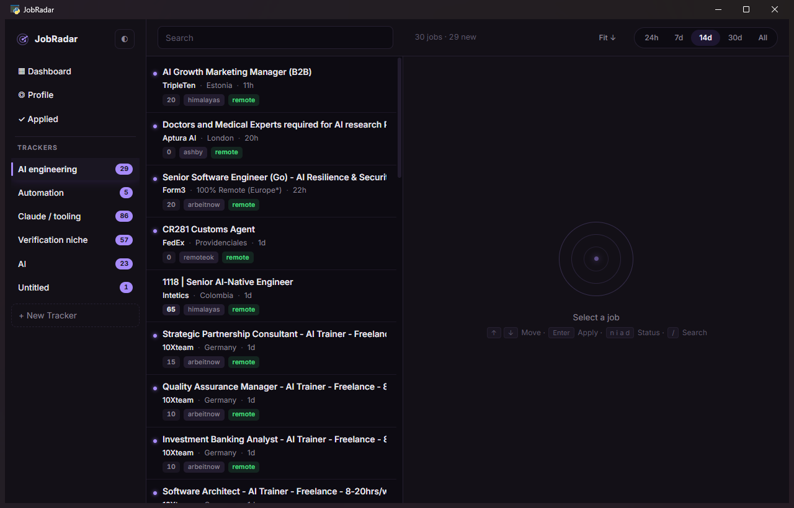
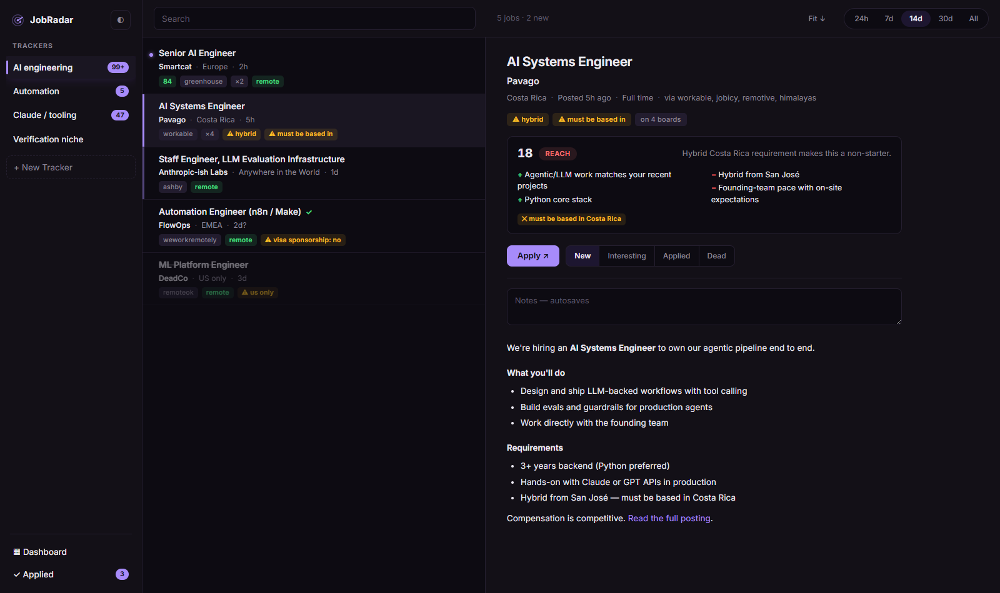
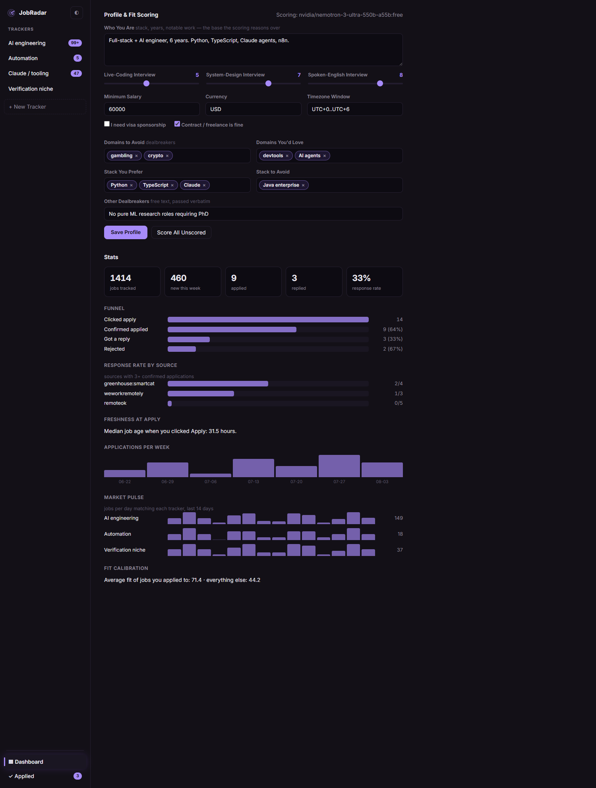
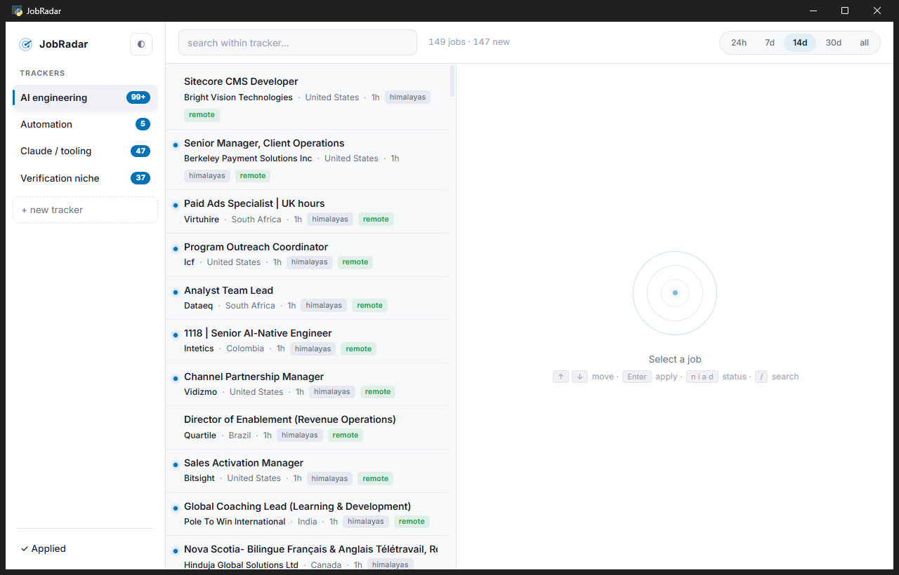

# JobRadar

Personal job-search aggregator. A worker polls ~20 job sources hourly, normalises and de-duplicates everything into Postgres, and a desktop app searches the local copy — because job boards are individually bad at search. LinkedIn doesn't index description bodies; Workable turns "agentic" into 2,015 leasing-agent listings. Fetch from everything, store it once, search your own copy.



```
  [hourly scheduler on a VPS]
              |
      per-source fetchers          one module per source, common interface
              |
        normalise                  map every source into one schema
              |
     fingerprint + upsert          dedupe collapses at write time
              |
          harvest slugs            apply URLs -> ats_registry -> direct feeds
              |
      Postgres tsvector            title + description, weighted
              |
         [Supabase]
              |
      desktop app (reader)         search, filter, track applications
```

## The interesting parts

**A slug-harvesting registry.** Every job found on an aggregator carries an apply URL. Parse it, extract the ATS and company slug (`boards.greenhouse.io/workato/...` → `greenhouse:workato`), store it, and poll that company's board directly forever after. Aggregators become a discovery mechanism; the registry becomes the real feed — authoritative data, exact publish dates, and listings that surface hours after posting. Polling is adaptive per board (hourly while producing → 6-hourly after 7 quiet days → daily after 30, deactivated on 404), decided by one SQL query.

**Dedupe as a database constraint.** Two fingerprints per job, matched on either at write time:

- `url_fp` — hash of the normalised apply URL, null when the host is a known aggregator redirect
- `content_fp` — hash of company + normalised title + geo, always computed

One fingerprint alone misses the most common duplicate pair: the aggregator copy (redirect URL) and the company's own ATS copy (clean URL) can never hash to the same value. Matching on either collapses them into one row that remembers every source it appeared on — and upgrades its apply link to the direct ATS URL the moment any source reveals it. Unique indexes are the race backstop.

**Isolated source modules.** One adapter per source behind a common interface; a source changing its response shape fails alone and is recorded in `source_health`, never taking the run down. HN "Who is hiring" — which has no structured fields at all — is one adapter's problem, not the pipeline's.

**Weighted full-text search.** A generated `tsvector` (title weighted A, company B, description C) makes "AI" match the word *AI* and never *email*, *training* or *maintain* — the two-letter-keyword problem `LIKE '%AI%'` can't solve. Trackers (saved searches with include/exclude terms, date window, location mode) are plain SQL over it.

**Location is three signals, not one field.** `location_raw` verbatim, a derived `remote_flag`, and `geo_flags[]` — red-flag phrases ("hybrid", "visa sponsorship: no", "must be based in") shown as badges. The app never classifies eligibility; structured location fields lie constantly, and a flag a human reads is more reliable than a boolean a machine guesses.

## Sources

| Tier | Sources |
|---|---|
| JSON/RSS aggregators | RemoteOK · Remotive · joblet.ai · Arbeitnow · Himalayas · Jobicy · Working Nomads · The Muse · WeWorkRemotely · HN "Who is hiring" |
| Registry-driven ATS boards | Greenhouse · Ashby · Lever · Workable (grown automatically from harvested slugs) |

Every endpoint is a public JSON API intended for programmatic use, an RSS feed, or a sitemap. **No LinkedIn, Indeed or Glassdoor adapters, ever** — their terms prohibit automated access.

## Fit scoring — calibrated to you, not to a keyword list

Describe yourself once — stack, years, constraints — plus three self-ratings
job boards never ask for: how confident you are in live-coding interviews,
system-design interviews, and interviewing in English. Every tracker match
then gets an LLM verdict:

- a **score** (0–100) and a **Safe / Stretch / Reach** label — the same job
  labels differently for different people, which is the point
- two-line reasons for and against
- **dealbreaker detection**: "needs US work authorization", "gambling
  company" — any hit caps the score at 20



Runs against **any OpenAI-compatible endpoint** — OpenRouter by default
(free-tier models work; verdicts above are from one), or point the API base
at OpenAI, Anthropic, Groq, or a fully local Ollama/LM Studio where job data
never leaves your machine. New matches score automatically in the
background, capped per open, cached until your profile changes. No key
configured → the feature is simply dormant.

## Reply detection

Attach your inbox (Gmail/Yahoo/custom — IMAP app passwords, stored only in
your local config, multiple accounts fine) and the app matches incoming
mail against companies you applied to: direct company domains, display
names, and ATS relays (Greenhouse/Lever/Ashby/…) when the subject names the
company. A match stores the full sanitised body, shows it under the job and
in the dashboard's Email tab, and flips the status to `replied` — your
funnel updates itself. Conservative on purpose: unmatched mail is never
stored, a missed match just means glancing at your inbox.

## The dashboard

Profile editing lives at the top; below it, stats job boards can't give you:
response rate **by source**, freshness-at-apply (median job age when you
clicked Apply — are you systematically late?), the application funnel with
conversion rates, market pulse per tracker, and fit calibration (average
score of jobs you applied to vs everything else).



## The app

pywebview + vanilla HTML/CSS/JS. No framework, no build step. Dark theme is near-black with a subtle violet accent; light theme is paper with sky.



- **Trackers** — saved searches that run side by side, each with a "new since last opened" count
- **Keyboard triage** — arrows to move, `n`/`i`/`a`/`d` to set status, `/` to search, Enter to apply
- **Applied page** — every job whose Apply button you clicked lands in a to-confirm list; confirm "I applied" or remove it. Answers "did I actually apply to that one?" after the browser opened and life happened
- Badges on every row: `remote`, geo red-flags, and ×N syndication count (a job on 5 boards is usually an agency requisition; one only on the company's own board is usually real)

## Setup

Full from-scratch walkthrough (Supabase project, Oracle free-tier VPS, packaging): **[docs/SETUP.md](docs/SETUP.md)**. Short version:

```bash
# 1. Database: create a Supabase project, run migrations/*.sql in order
#    (RLS is deny-all; the REST API exposes nothing — access is direct Postgres)

# 2. Worker
pip install -r requirements.txt
cp .env.example .env        # DATABASE_URL = the *session pooler* string (IPv4)
python -m worker.main --dry-run   # fetch + normalise, no database
python -m worker.main --once      # one full cycle
python -m worker.main             # run forever

# 3. Desktop app
python -m app.main          # reads jobradar.toml (created on first run)

# 4. Tests
python -m pytest tests
```

Deployment: `deploy/jobradar-worker.service` (systemd). Packaging: `pyinstaller --onefile --windowed --name JobRadar --add-data "app/web;app/web" app_entry.py` — the binary carries no credentials; it reads `jobradar.toml` next to itself.

## Notes

- The direct Supabase connection string is IPv6-only; use the **session pooler** from a host without IPv6.
- pywebview mirrors Python parameter names into its generated JS stubs — an API parameter named `window` shadows the JS global and breaks the bridge. Ask me how I know.
- Sources credited per their terms; RemoteOK asks for a link back: [remoteok.com](https://remoteok.com).
